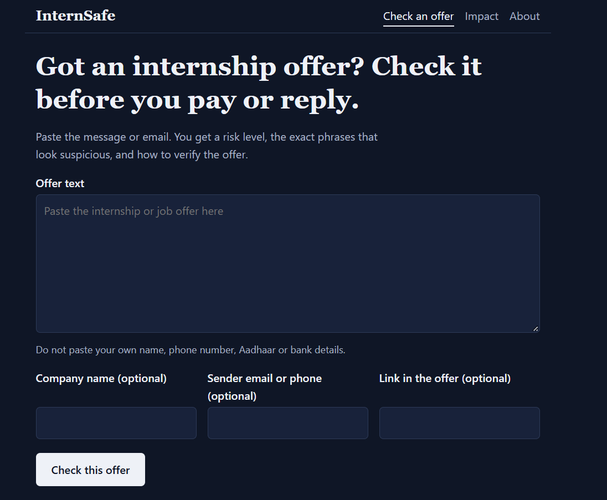
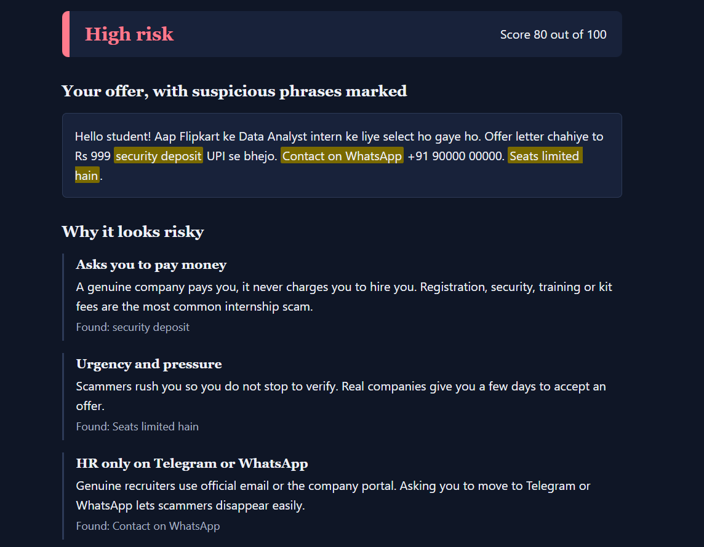
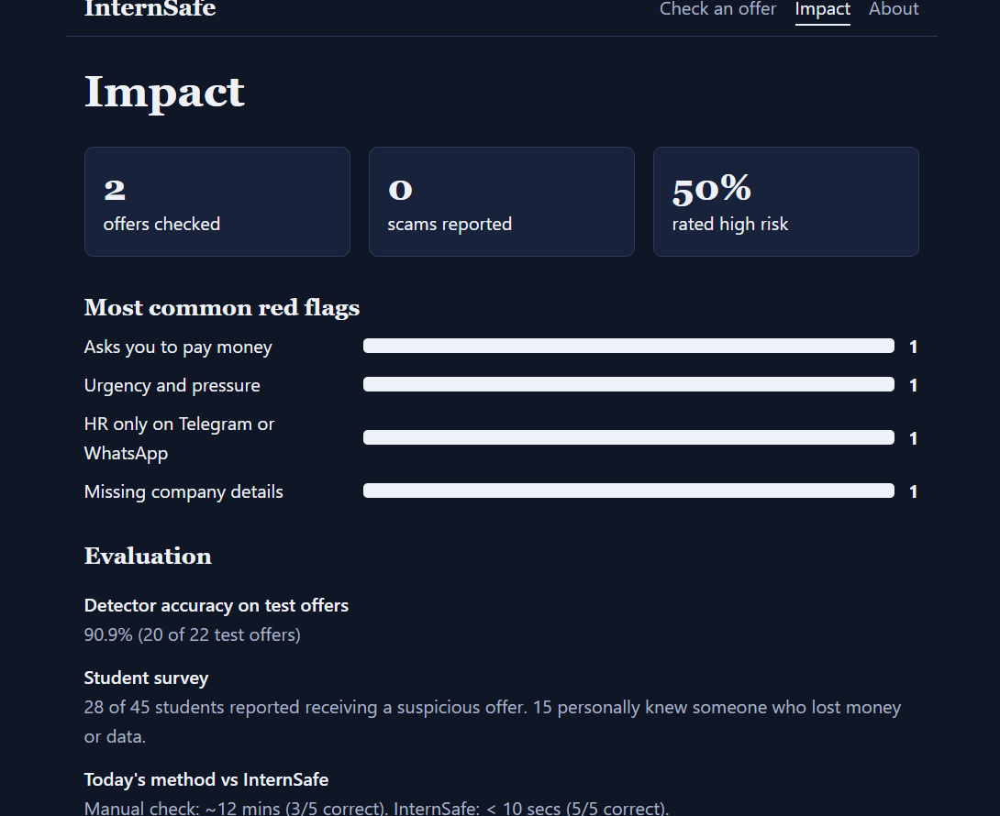

# InternSafe

Check an internship or job offer for scam red flags in about 10 seconds.
Built for the hackathon at wecodecoders.in, Track 02: Open Innovation (area: Safety and trust).

Team: _add team name and members_ · Live demo: _add Render link_ · Demo video: _add link_

## Problem and evidence

Students in India lose money and personal data to fake internship offers: registration or security fees, "100% placement", fake HR on Telegram or WhatsApp, pressure to pay today. There is no quick way to check an offer, so students guess or ask friends.

Evidence from our student survey: 28 of 45 students received a suspicious offer, and 15 personally knew someone who paid a scammer.

## How students check offers today vs InternSafe

| | Today | InternSafe |
|---|---|---|
| Method | Google it, ask friends in WhatsApp groups, guess | Paste the offer, get a result |
| Time per offer | ~2.5 minutes | < 10 seconds |
| Explains why | No | Yes, every flag has a reason and the exact phrase is highlighted |

## Features

- Risk level (Low / Medium / High) and a score from 0 to 100
- Suspicious phrases highlighted inside the original text, with a plain-language reason for each
- A "How to verify this offer" checklist matched to the flags found
- "Report this scam" button and an Impact page (offers checked, scams reported, most common red flags)
- Understands English and Hinglish ("registration ke liye paise bhejo", "ghar baithe kamao")
- Privacy: the pasted text is never saved; reports are saved only after removing emails, phone numbers and long numbers

## How the detection works

No AI API is used. `backend/detector.js` holds 11 rules. Each rule has a weight (for example "asks you to pay money" = 40, "guaranteed selection" = 25). Triggered weights add up to a score capped at 100: 0-29 Low, 30-59 Medium, 60+ High. The same offer always gets the same result, and every flag can be explained. Negations are handled, so "there is no registration fee" is not flagged.

## Tech stack

React (Vite) · Node.js + Express · JSON file storage. Express also serves the built React app, so the whole project deploys as one service.

## Setup and run

Needs Node.js 18 or newer.

```
npm install
cd frontend && npm install && cd ..
npm start              # backend on http://localhost:3000
npm run dev:client     # frontend on http://localhost:5173 (second terminal)
```

Single-service mode (as in production): `npm run build`, then `npm start`, and open http://localhost:3000.

Deploy on Render: Build command `npm install && npm run build`, Start command `npm start`, environment variables `NODE_VERSION=22` and `TRUST_PROXY=1`.

## Test results

```
npm test           # detector accuracy on tests/samples.json
npm run test:api   # 9 API tests
```

Detector accuracy: **20 of 22 test offers correct (90.9%)** with 13 scam and 9 genuine samples, including 4 in Hinglish. The two misses are deliberate hard cases (see Limitations). The samples were written by the team, so the number is optimistic, though it matches our findings from the 45 surveyed students.

## Screenshots





## AI tools used

This project was built with AI assistance (Claude by Anthropic) for planning, code and documentation, as the hackathon rules allow. The team reviewed the code and can explain every rule and file.

## Disclosure

No template or previously written code was used. Confirmed: all code was written specifically for this hackathon. Libraries (all open source, MIT): express, cors, express-rate-limit, react, react-dom, vite, @vitejs/plugin-react.

## Limitations

- A politely written task scam with no fee and no obvious phrases is missed (sample S13).
- A genuine offer that asks for bank details after joining is flagged Medium (sample G09).
- Rules cover English and Hinglish only, and cannot verify that a company really exists.
- JSON storage is meant for one server. On a free host, stats and reports can reset when the service restarts.
- The test set is small and written by the team.

## Future work

Add a company-registry lookup, more languages, a browser extension for LinkedIn and WhatsApp Web, and a larger test set built from real reported offers.
